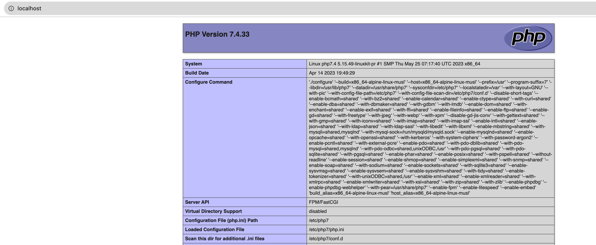

# Alpine LEMP Stack

This repository provides a Docker-based Alpine Linux image configured with the LEMP stack (Linux, Nginx, MySQL, PHP). It includes PHP 7.4, MySQL 5.7, Nginx, and PhpMyAdmin. Follow the steps below to set up the environment:

## Clone the Repository

Step 1: Clone the repository using the following command:

```bash
git clone git@github.com:atif-ali-aa/alpine-lemp-stack.git
```

## Build the Docker Images

Step 2: Change to the cloned directory and run the Docker Compose build command. This process may take some time as it creates the necessary images.

```bash
cd alpine-lemp-stack
docker-compose up -d --build
```

## Retrieve MySQL Root Password

Step 3: To manage the MySQL instance, obtain the MySQL root password and store it in a file using the following command:

```bash
docker logs -f mysql-5.7 | grep --line-buffered "GENERATED" >> mysql-root-credentials.txt
```

## Accessing the Web Application

Step 4: Open your web browser and visit `localhost`. You should see the PHP version displayed on the page.




## Accessing PhpMyAdmin

Step 5: To use PhpMyAdmin, simply navigate to `localhost/pma` in your web browser. Use the MySQL root credentials obtained in Step 3 to log in and manage your databases.

Please note that this setup utilizes Docker to provide an isolated and consistent development environment. Ensure you have Docker installed and running on your system before following these steps.

Feel free to explore the repository and customize the configurations according to your project requirements. If you encounter any issues or have suggestions, feel free to open an issue or submit a pull request. Happy coding!